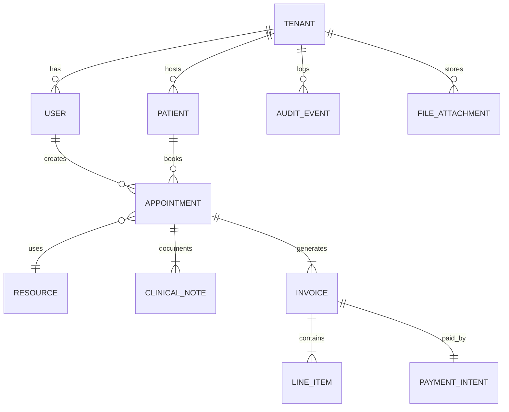

# Patient & Studio Scheduler

Welcome to the Patient & Studio Scheduler repository. This healthcare SaaS platform enables therapists, clinics, and wellness studios to manage appointments, document treatments, handle billing, and ensure HIPAA compliance.

## Implementation Status

An extensive implementation plan has been created and documented. The plan details:

- Architecture decisions with multi-tenant approach and PHI security
- Development environment configuration with Docker
- IDE setup optimized for healthcare application development
- Code quality tools with healthcare-specific checks
- CI/CD pipeline with enhanced security scanning

### ✅ Phase 1-3: Completed

- **Phase 1**: Development environment, foundational architecture, CI/CD pipeline
- **Phase 2**: Authentication (Auth0 + MFA), audit logging, security infrastructure
- **Phase 3**: Patient self-service appointment booking with availability checking

### 🚀 Phase 4: Just Completed (2025-11-07)

**Practitioner Calendar Management & Scheduling** - Full-featured calendar interface with waitlist automation.

**Backend Features**:
- Practitioner availability configuration (weekly hours with JSONB storage)
- FIFO waitlist management with auto-notification on cancellations
- RFC 5545-compliant iCal feed export (HIPAA-compliant, token-authenticated)
- Calendar token generation with secure randomBytes
- Comprehensive validation (time format, overlaps, durations)

**Frontend Features**:
- Full monthly calendar view with color-coded appointment statuses
- Availability settings modal with real-time validation
- Waitlist panel with FIFO ordering and position badges
- One-click iCal URL generation with clipboard copy
- Responsive design (mobile/tablet/desktop)

**Documentation**:
- [API Documentation](docs/api-phase4.md) - Complete REST API reference
- [Frontend Components](docs/frontend-components-phase4.md) - React component library
- [iCal Integration Guide](docs/ical-integration-guide.md) - Calendar app setup instructions

**Key Metrics**:
- 3 new backend services (Practitioners, Waitlist, Calendar)
- 3 new frontend components (FullCalendar, AvailabilitySettings, WaitlistPanel)
- 1,450+ lines of backend code
- 1,060+ lines of frontend code
- 100% CI passing (linting, type checking, builds)

### Phase 5 & Beyond (Upcoming)

Next priorities based on the PRD:
1. **Clinical Documentation**: SOAP notes with AI autocompletion
2. **Billing & Payments**: Stripe integration with invoicing
3. **Patient Portal**: Document access and messaging

### Phase 1 Implementation (Foundation - Completed)

Previously completed **Phase 1** (Weeks 1-2) priorities:

1. **Development Environment**: Docker Compose with PostgreSQL, Redis, MinIO, and Mailpit
2. **Developer Tooling**: VS Code Dev Container, ESLint, Prettier, and pre-commit hooks
3. **Foundational Architecture**: Row-level security, field-level encryption, database schema
4. **CI/CD Pipeline**: GitHub Actions with security scanning and development deployment

### Getting Started

1. Review the [Implementation Plan](implementation-plan.md) for a high-level overview
2. Check [Tasks](cursor-memory-bank/tasks.md) for detailed task breakdown with checkboxes
3. See [Progress Tracking](cursor-memory-bank/progress.md) for current implementation status

### Documentation

For comprehensive details, please see the following documentation:

- [Architecture Decisions](cursor-memory-bank/architecture-decisions.md) - Technical architecture details
- [Development Environment](cursor-memory-bank/development-environment.md) - Local development setup
- [IDE Configuration](cursor-memory-bank/ide-configuration.md) - VS Code optimization
- [Code Quality Tools](cursor-memory-bank/code-quality-tools.md) - Standards and enforcement

## Product Requirements Document (PRD)

**Version**: 1.1
**Status**: Working Draft (post‑assistant review)
**Date**: 9 May 2025 (UTC+3)

---

## 1. Purpose & Vision

A cloud‑native SaaS platform that enables solo therapists, multi‑disciplinary clinics, and wellness studios to:

* **Book & manage appointments** with zero‑friction UX across devices.
* **Document treatments** in structured or free‑text form and generate compliant medical summaries.
* **Handle billing** from pre‑payment through invoicing, including local tax rules.
* **Remain secure & compliant** (HIPAA, GDPR, ISO 27001 alignment; SOC 2 Type II target by v3).
* **Leverage AI agents** (internal MCP) for smart scheduling, triage, and practice analytics.
* **Engage patients** via a self‑service portal (v1), telehealth (v2), and insurance workflows (v3).

---

## 2. Scope (Phased Delivery)

| Phase             | In Scope                                                                                                          | Out of Scope                  |
| ----------------- | ----------------------------------------------------------------------------------------------------------------- | ----------------------------- |
| **1 – MVP**       | Diary, treatment notes, basic payments, patient‑portal‑lite (booking & document download), customizable reminders | Direct EHR integrations       |
| **2 – Expansion** | Telehealth, marketing export (Mailchimp), secure messaging (demand‑driven)                                        | Native desktop client         |
| **3 – Advanced**  | Insurance claim processing, public add‑on marketplace, SOC 2 compliance                                           | Inpatient hospital scheduling |

---

## 3. Target Users & Personas

| Persona                   | Goals                                                       | Pain Points                                 |
| ------------------------- | ----------------------------------------------------------- | ------------------------------------------- |
| **Solo Therapist "Maya"** | Fill schedule, reduce no‑shows, avoid admin overhead        | Manual reminders, duplicate data entry      |
| **Clinic Admin "Avi"**    | Coordinate 10 clinicians/rooms, manage cash‑flow, reporting | Calendar conflicts, billing errors          |
| **Patient "Dana"**        | Self‑serve booking & payments, secure access to documents   | Friction in rescheduling, unclear follow‑up |

---

## 4. User Journeys (Happy Path)

1. **Booking** – Dana opens branded link → selects service & clinician → chooses real‑time slot (2‑way Google Calendar sync).
2. **Payment** – Secure pre‑payment captured (Stripe).
3. **Reminders** – System sends 48 h & 2 h reminders (SMS/email/WhatsApp).
4. **Treatment** – Post‑session, Maya records SOAP note → generates PDF summary → optionally shares with Dana.
5. **Billing** – Invoice auto‑created → synced to QuickBooks.

---

## 5. Functional Requirements

### 5.1 Diary Management

| ID    | Requirement                                  | Priority |
| ----- | -------------------------------------------- | -------- |
| DM‑01 | Drag‑and‑drop calendar (day/week/agenda)     | **Must** |
| DM‑02 | Conflict detection (clinician, room, device) | **Must** |
| DM‑03 | 2‑way Google Calendar sync (OAuth)           | **Must** |
| DM‑04 | Customizable multi‑channel reminders         | **Must** |
| DM‑05 | Wait‑list & auto‑fill cancellations          | Could    |

### 5.2 Patient Portal (v1 "Lite")

| ID    | Requirement                                         | Priority |
| ----- | --------------------------------------------------- | -------- |
| PP‑01 | Secure login (magic link or email + OTP)            | **Must** |
| PP‑02 | View / book / reschedule appointments               | **Must** |
| PP‑03 | Download shared documents (PDF summaries, invoices) | **Must** |
| PP‑04 | Profile settings & consent management               | Should   |
| PP‑05 | Secure async chat                                   | Deferred |

### 5.3 Treatment / Session Tracking

| ID    | Requirement                                  | Priority |
| ----- | -------------------------------------------- | -------- |
| TS‑01 | Configurable templates (SOAP, custom fields) | **Must** |
| TS‑02 | Attach images / PDF / video                  | Should   |
| TS‑03 | Generate branded medical summary (DOCX/PDF)  | **Must** |
| TS‑04 | Versioning & audit trail                     | **Must** |

### 5.4 Accounting & Payments

| ID    | Requirement                         | Priority |
| ----- | ----------------------------------- | -------- |
| AC‑01 | Invoice generation (single & batch) | **Must** |
| AC‑02 | Card‑on‑file / pre‑payment (Stripe) | **Must** |
| AC‑03 | Credit‑pack management              | Should   |
| AC‑04 | Export to CSV & QuickBooks/Xero     | Could    |

### 5.5 Information Security & Compliance

| ID    | Requirement                                                      | Priority |
| ----- | ---------------------------------------------------------------- | -------- |
| IS‑01 | TLS 1.3 in transit, AES‑256‑GCM at rest                          | **Must** |
| IS‑02 | Tenant isolation (row‑level security; per‑tenant schemas by v2+) | **Must** |
| IS‑03 | Encrypted daily backups (S3, KMS), 30‑day retention              | **Must** |
| IS‑04 | Audit logging for PHI access & admin actions                     | **Must** |
| IS‑05 | GDPR data‑subject endpoints (export/delete)                      | **Must** |

### 5.6 AI & MCP Integration

| ID    | Requirement                                               | Priority |
| ----- | --------------------------------------------------------- | -------- |
| AI‑01 | Conversational booking bot (web widget)                   | Should   |
| AI‑02 | Internal MCP server for schedule queries & admin commands | **Must** |
| AI‑03 | Note autocompletion & ICD‑10 suggestions                  | Could    |

### 5.7 Telehealth (v2)

| ID    | Requirement                             | Priority |
| ----- | --------------------------------------- | -------- |
| TH‑01 | Zoom Video SDK integration (HIPAA BAA)  | Should   |
| TH‑02 | Appointment type: virtual vs. in‑person | Should   |
| TH‑03 | Consent & bandwidth checks              | Should   |

### 5.8 Insurance Claims (v3)

| ID    | Requirement                    | Priority |
| ----- | ------------------------------ | -------- |
| IN‑01 | X12/EDI 837P submission        | Could    |
| IN‑02 | Denial & resubmission workflow | Could    |
| IN‑03 | Payer contract configuration   | Could    |

### 5.9 Marketing Export (v2)

| ID    | Requirement                                   | Priority |
| ----- | --------------------------------------------- | -------- |
| MK‑01 | One‑way sync of patient segments to Mailchimp | Should   |
| MK‑02 | PHI scrubbing & marketing consent check       | **Must** |

---

## 6. Non‑Functional Requirements

* **Performance**: p95 API < 250 ms; calendar render < 1 s
* **Scalability**: Horizontally scalable; start with <100 tenants on a single Node cluster, auto‑scale via KEDA; target 10 k tenants, 500 k MAU by Phase 3.
* **Availability**: 99.9 % monthly SLA (MVP), 99.95 % by Phase 2.
* **Localization**: EN, HE, DE initial (intl framework ready).
* **Accessibility**: WCAG 2.1 AA.
* **Mobile**: Responsive PWA; offline caching for notes.

---

## 7. Tech Stack (Runtime)

| Layer            | Technology                                                                       | Notes                                                  |
| ---------------- | -------------------------------------------------------------------------------- | ------------------------------------------------------ |
| Frontend         | **React 18**, Vite, Tailwind CSS, shadcn/ui                                      | Modern accessible UI                                   |
| Backend          | **Node.js 20 (NestJS)**, TypeScript                                              | Monorepo; strict e2e types                             |
| Data             | **PostgreSQL 16 (Aurora Serverless v2)**                                         | Scale‑to‑zero, automatic vertical & horizontal scaling |
| Realtime / Tasks | **Redis 7 (@AWS ElastiCache)**, **BullMQ**, **AWS SQS** for offloading long jobs | Replace Redis with MemoryDB if HA needed               |
| Object Storage   | **AWS S3**                                                                       | PHI encryption (SSE‑KMS)                               |
| AI               | **OpenAI GPT‑4o** via internal MCP gateway (LangChain)                           | Rate‑limit, encryption proxy                           |
| Auth             | **Auth0** (OIDC), tenant‑aware RBAC                                              | Optional SSO add‑on                                    |
| Payments         | **Stripe Connect**                                                               | Global coverage                                        |
| Video            | **Zoom Video SDK**                                                               | Phase 2                                                |
| Observability    | **OpenTelemetry → Grafana Cloud**                                                | Traces & metrics                                       |
| Infra as Code    | **Terraform + Terragrunt**                                                       | Git‑ops                                                |

---

## 8. Data Model (Detailed v1.1)

### 8.1 Entity Relationship Overview

### 8.2 Logical Schema (key columns)

| Table                | Key Columns                                                                 | Partition / Index Strategy | Notes                          |
| -------------------- | --------------------------------------------------------------------------- | -------------------------- | ------------------------------ |
| **tenant**           | id (uuid PK), name, plan, created_at                                       | —                          | One row per business           |
| **user**             | id PK, tenant_id FK, email (+ unique composite), role, status              | Tenant‑hash‑partition      | Clinicians & admins            |
| **patient**          | id PK, tenant_id, dob, phone, tags JSONB                                   | Tenant‑hash‑partition      | PII encrypted columns          |
| **appointment**      | id PK, tenant_id, patient_id, start_ts, end_ts, status, payment_status | BRIN index on start_ts    | Cancel/no‑show tracking        |
| **clinical_note**   | id PK, appointment_id FK, author_id, template, content JSONB              | —                          | Row‑level PG‑crypto encryption |
| **invoice**          | id PK, tenant_id, total_cents, currency, status                           | —                          | Stripe reference stored        |
| **line_item**       | id PK, invoice_id FK, description, qty, price_cents                       | —                          | —                              |
| **payment_intent**  | id PK, invoice_id, stripe_pi, status                                      | —                          | Relevant webhooks              |
| **resource**         | id PK, tenant_id, type (room/device), name                                 | —                          | Calendar resource map          |
| **audit_event**     | id PK, tenant_id, actor_id, entity, diff JSONB, ts                        | PARTITION BY MONTH         | Hot/cold logs rotation         |
| **file_attachment** | id PK, tenant_id, object_key, mime_type, linked_entity, ts              | —                          | S3 object reference            |

> **Scaling Note** – Tenant‑key hashing enables even data distribution across shards *(Aurora v2 supports up to 15 replicas / IAM auth)*. Audit events are partitioned time‑linearly to keep hot partitions small.

---

## 9. APIs & Integrations

* **Protocols**: REST (/v1), GraphQL (/graphql), gRPC (MCP internal).
* **Webhooks**: appointment.created/updated/cancelled, invoice.paid/failed, patient.consent‑updated.
* **External Integrations**: Google Calendar, Stripe, QuickBooks/Xero, Zoom SDK (v2), Mailchimp (v2).
* **Internal**: MCP orchestrator ⇄ Postgres via SQLc‑generated clients.

---

## 10. UX / UI Guidelines

* Calendar color‑codes (status, payment).
* Global command palette (⌘ K) routed to MCP.
* Dark‑mode default for clinicians; auto OS‑theme detection.
* Inline AI ghost text suggestions.
* ADA / WCAG‑compliant forms & colour contrast.

---

## 11. KPIs (Phase 1 Targets)

| Category        | Metric                           | Target  |
| --------------- | -------------------------------- | ------- |
| Adoption        | Tenants onboarded (90 d)         | 50      |
| Engagement      | Avg appointments / tenant / week | 120     |
| Reliability     | 5xx error rate                   | < 0.1 % |
| AI Usage        | Notes w/ AI assist               | 30 %    |
| Financial       | Payment success                  | ≥ 97 %  |
| Cost Efficiency | Avg infra cost / tenant / month  | < 1 USD |

---

## 12. Risks & Mitigations

| Risk                          | Mitigation                                     |
| ----------------------------- | ---------------------------------------------- |
| Calendar sync race conditions | Etags, optimistic locking                      |
| HIPAA breach                  | BAA, encryption, yearly pen‑tests              |
| LLM hallucination in notes    | Confidence score, human review                 |
| PHI leakage via marketing     | Export‑only, consent flags                     |
| Telehealth latency            | Zoom SDK, regional pop‑outs                    |
| Runaway hosting costs         | KEDA HPA, spot instances, Cost Explorer alerts |

---

## 13. Timeline & Milestones

| Phase         | Duration | Key Deliverables                                                |
| ------------- | -------- | --------------------------------------------------------------- |
| 0 – Discovery | 4 w      | UX research, refined specs                                      |
| 1 – MVP       | 14 w     | Diary, notes, payments, patient portal lite, advanced reminders |
| 1.5 – Beta+   | 4 w      | Feedback loop, compliance audit                                 |
| 2 – Expansion | 8 w      | Telehealth, marketing export, optional secure chat              |
| 3 – Advanced  | 12 w     | Insurance claims, public API & marketplace                      |

---

## 14. Approval

| Stakeholder        | Role | Signature | Date |
| ------------------ | ---- | --------- | ---- |
| Product Lead       |      |           |      |
| Engineering Lead   |      |           |      |
| Compliance Officer |      |           |      |
| Finance            |      |           |      |

---

## 15. Appendices

* **A. Regulatory Mapping Matrix** (HIPAA/GDPR/ISO‑27001)
* **B. Data Dictionary v1.1**
* **C. UX Wireframes** (Figma)

---

## 16. Development Environment & DevOps *(NEW)*

| Aspect              | Baseline                                                  | Notes                                                 |
| ------------------- | --------------------------------------------------------- | ----------------------------------------------------- |
| **Source Control**  | GitHub Org → trunk‑based dev (feat branches)              | Conventional Commits + Semantic Release               |
| **Monorepo Tools**  | pnpm (workspaces), Nx for task orchestration              | Fast incremental builds                               |
| **Local Dev**       | Docker Compose: postgres, redis, minio (S3‑mock), mailpit | `make up` boots full stack locally                    |
| **Editors**         | VS Code (Dev Containers + Remote WSL)                     | .devcontainer image for parity                      |
| **CI/CD**           | GitHub Actions → AWS CodeBuild / EKS deploy               | PR checks: lint, type‑check, tests, OPA security scan |
| **IaC**             | Terraform + Terragrunt, remote state in S3 + Dynamo lock  | Env per workspace (dev / staging / prod)              |
| **Feature Flags**   | LaunchDarkly (SDK)                                        | Gradual roll‑outs, A/B tests                          |
| **Testing Pyramid** | Jest (unit), Pact (contract), Cypress (e2e)               | 80 %+ unit coverage target                            |
| **Secrets**         | AWS Secrets Manager, Doppler for local                    | No secrets in env vars/CI logs                        |
| **Observability**   | Otel collector in‑cluster → Grafana Cloud                 | SLO dashboards, alert rules (PagerDuty)               |

> **Cost‑Control** – Developer playground environments auto‑suspend nightly (kube‑downscaler) and on weekends.

---

## 17. Scaling & Cost Optimization *(NEW)*

| Stage                     | Compute Strategy                           | DB Strategy                                 | Monthly Infra ± (50 tenants) | Notes                                        |
| ------------------------- | ------------------------------------------ | ------------------------------------------- | ---------------------------- | -------------------------------------------- |
| **Bootstrap**             | Single t3.small Fargate task (+ spot)      | Aurora Serverless v2 2 ACUs (scale‑to‑zero) | ≈ 80 USD                     | Under free‑tier limits for first testers     |
| **Growth (≤1 k tenants)** | 2–4 tasks (autoscaled), Redis replica ×1   | Aurora v2 4–16 ACUs                         | ≈ 400 USD                    | Reserve instances, KEDA based on queue depth |
| **Scale‑out (10 k+)**     | EKS on spot / on‑demand mix; Karpenter HPA | Aurora sharding by tenant‑id hash           | ≈ 6 k USD                    | Multi‑AZ, blue‑green deploys                 |

Additional levers: 1‑year Compute Savings Plans (\~30 % cut), S3 Intelligent‑Tiering, limit AI token usage via per‑tenant quotas.

---

**Next Actions (for stakeholders)**

1. **Review Sections 6–8 & 16–17** for feasibility & cost alignment.
2. Provide sign‑off or change‑requests before 15 May 2025 to keep MVP timeline on track.
